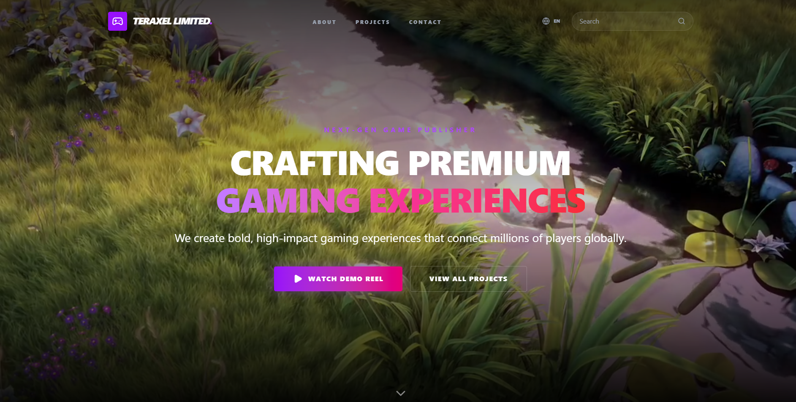
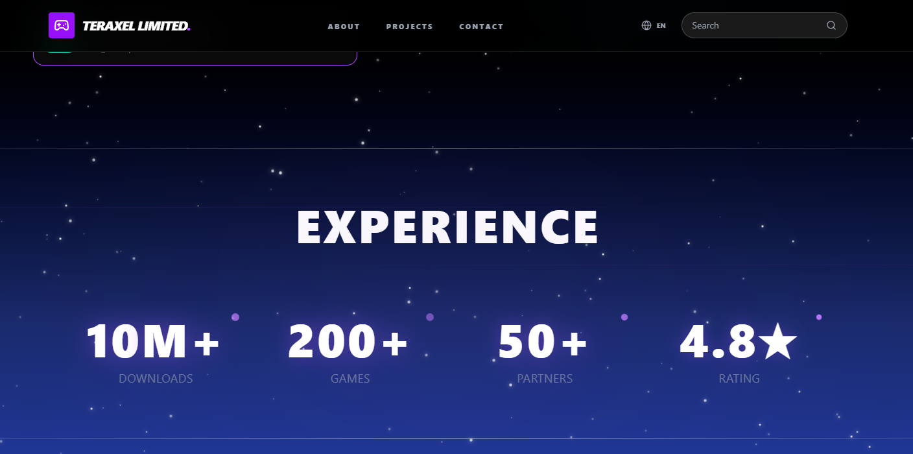
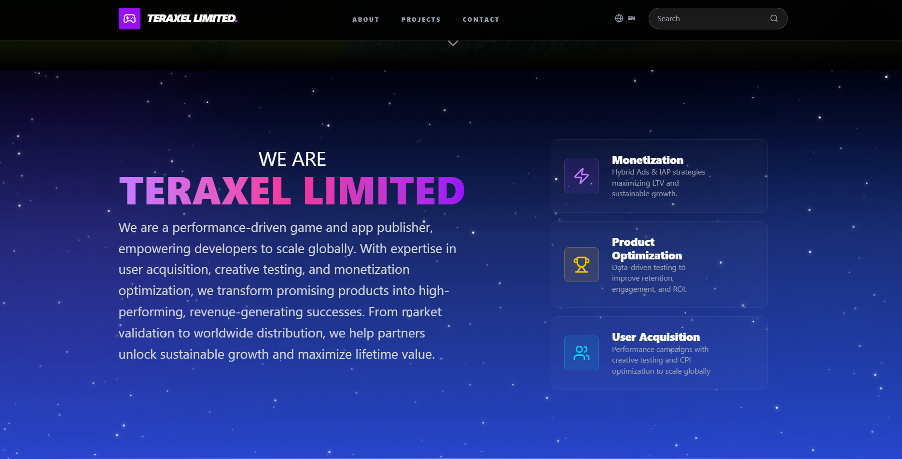
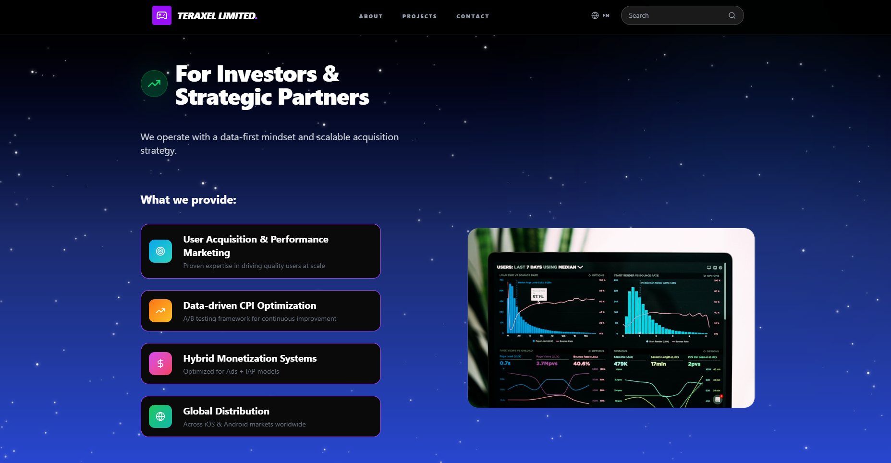
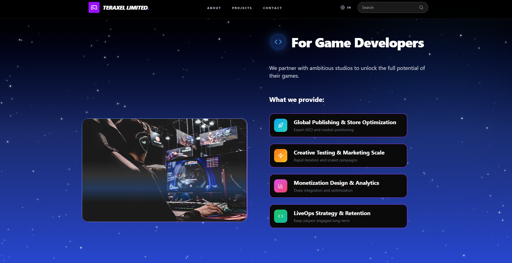
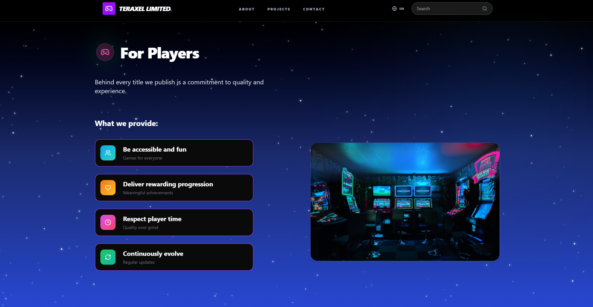
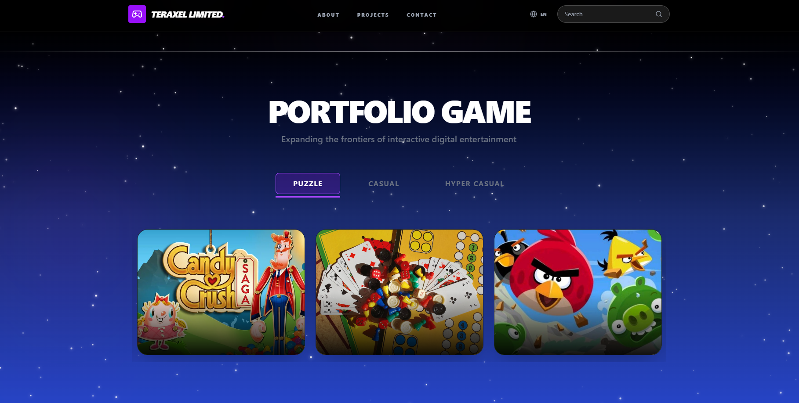
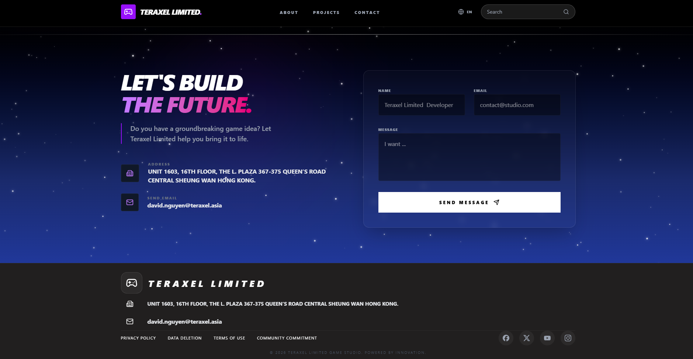

# Teraxel Asia - Web Game Publisher UI Design

> **Một nền tảng phát hành Game hiện đại chuyên biệt cho dòng Puzzle, Casual và Hyper Casual.**

### 🔗 Trải nghiệm dự án
* **Website:** [https://teraxel.asia](https://teraxel.asia)
* **Tech Stack:** React + Vite + Tailwind CSS

---

## 🎨 Tổng Quan Giao Diện
Dự án được thiết kế với phong cách hiện đại, tập trung vào hiệu ứng thị giác và trải nghiệm người dùng mượt mà. Điểm nhấn là sự kết hợp giữa hiệu ứng nền sao (**Star Background**) và các khối nội dung chuyên nghiệp dành cho đối tượng Người chơi, Nhà phát triển và Nhà đầu tư.

---

## 🛠 Công Nghệ Sử Dụng
* **Core:** React.js (với Vite để tối ưu hóa tốc độ build).
* **Styling:** Tailwind CSS (Responsive và tối ưu hóa UI linh hoạt).
* **Architecture:** Component-driven development.

---

## 📸 Hình Ảnh Demo
### 1. Hero Section (Trang chủ)

### 2. Chỉ số & Cộng đồng

### 3. Giới thiệu 

### 4. Đối tác, Nhà đầu tư, Người chơi 
 

### 5. Game Portfolio

### 6. Footer & Liên hệ 

---
